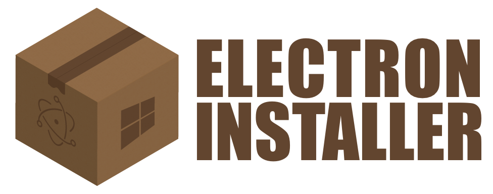

# electron-installer-windows [](https://www.npmjs.com/package/electron-installer-windows) [](http://travis-ci.org/electron-userland/electron-installer-windows) [](https://ci.appveyor.com/project/electron-userland/electron-installer-windows)

> Create a Windows package for your Electron app.

This tool relies on the awesome [Squirrel.Windows](https://github.com/Squirrel/Squirrel.Windows) framework written by [@paulcbetts](https://github.com/paulcbetts). It takes care of creating the actual package, signing it, dealing with updates, and many more things. Gotta give credit where credit is due, ya know.


## Requirements

This tool requires Node 10 or greater.

I'd recommend building your packages on your target platform, but if you have to run this on Mac OS X or Linux, you will need to install `mono` and `wine` through your package manager.

You won't get an `.msi` installer though, only `.nupkg` and `.exe` installers. To get an `.msi` installer you'll need to run on Windows.


## Installation

For use from command-line:

```shell
$ npm install -g electron-installer-windows
```

For use in npm scripts or programmatically:

```shell
$ npm install --save-dev electron-installer-windows
```


## Usage

Say your Electron app lives in `path/to/app` and has a structure like this:

```
.
├── LICENSE
├── README.md
├── node_modules
│   ├── electron-packager
│   └── electron-prebuilt
├── package.json
├── resources
│   ├── Icon.png
│   ├── IconTemplate.png
│   └── IconTemplate@2x.png
└── src
    ├── index.js
    ├── main
    │   └── index.js
    └── renderer
        ├── index.html
        └── index.js
```

You now run `electron-packager` to build the app for Windows:

```shell
$ electron-packager . app --platform win32 --arch x64 --out dist/
```

And you end up with something like this in your `dist` folder:

```
.
└── dist
    └── app-win32-x64
        ├── LICENSE
        ├── LICENSES.chromium.html
        ├── content_resources_200_percent.pak
        ├── content_shell.pak
        ├── d3dcompiler_47.dll
        ├── icudtl.dat
        ├── libEGL.dll
        ├── libGLESv2.dll
        ├── locales
        ├── msvcp120.dll
        ├── msvcr120.dll
        ├── natives_blob.bin
        ├── node.dll
        ├── pdf.dll
        ├── app.exe
        ├── resources
        ├── snapshot_blob.bin
        ├── ui_resources_200_percent.pak
        ├── vccorlib120.dll
        ├── version
        └── xinput1_3.dll
```

How do you turn that into a Windows package that your users can install?

### Command-Line

If you want to run `electron-installer-windows` straight from the command-line, install the package globally:

```shell
$ npm install -g electron-installer-windows
```

And point it to your built app:

```shell
$ electron-installer-windows --src dist/app-win32-x64/ --dest dist/installers/
```

You'll end up with the package at `dist/installers/app-0.0.1-setup.exe`.

### Scripts

If you want to run `electron-installer-windows` through npm, install the package locally:

```shell
$ npm install --save-dev electron-installer-windows
```

Edit the `scripts` section of your `package.json`:

```json
{
  "name": "app",
  "description": "An awesome app!",
  "version": "0.0.1",
  "scripts": {
    "start": "electron .",
    "build": "electron-packager . app --platform win32 --arch x64 --out dist/",
    "setup": "electron-installer-windows --src dist/app-win32-x64/ --dest dist/installers/"
  },
  "devDependencies": {
    "electron-installer-windows": "*",
    "electron-packager": "*",
    "electron-prebuilt": "*"
  }
}
```

And run the script:

```shell
$ npm run setup
```

You'll end up with the package at `dist/installers/app-0.0.1-setup.exe`.

### Programmatically

Install the package locally:

```shell
$ npm install --save-dev electron-installer-windows
```

And write something like this:

```javascript
const installer = require('electron-installer-windows')

const options = {
  src: 'dist/app-win32-x64/',
  dest: 'dist/installers/'
}

async function main (options) {
  console.log('Creating package (this may take a while)')
  try {
    await installer(options)
    console.log(`Successfully created package at ${options.dest}`)
  } catch (err) {
    console.error(err, err.stack)
    process.exit(1)
  }
}
main(options)
```

You'll end up with the package at `dist/installers/app-0.0.1-setup.exe`.

_Note: As of 2.0.0, the Node-style callback pattern is no longer available. You can use [`util.callbackify`](https://nodejs.org/dist/latest-v8.x/docs/api/util.html#util_util_callbackify_original) if this is required for your use case._


### Options

Even though you can pass most of these options through the command-line interface, it may be easier to create a configuration file:

```json
{
  "dest": "dist/installers/",
  "icon": "resources/Icon.ico",
  "tags": [
    "Utility"
  ]
}
```

And pass that instead with the `config` option:

```shell
$ electron-installer-windows --src dist/app-win32-x64/ --config config.json
```

Anyways, here's the full list of options:

#### src
Type: `String`
Default: `undefined`

The path to the folder that contains your built Electron application.

#### dest
Type: `String`
Default: `undefined`

The path to the folder that will contain your Windows installer.

#### rename
Type: `Function`
Default: `function (dest, src) { return path.join(dest, src); }`

A function that renames all files generated by the task just before putting them in your `dest` folder.

#### options.name
Type: `String`
Default: `package.name`

Name of the package (e.g., `atom`), used in the [`id` field of the `nuspec` file](https://docs.nuget.org/create/nuspec-reference).

#### options.productName
Type: `String`
Default: `package.productName || package.name`

Name of the application (e.g., `Atom`), used in the [`title` field of the `nuspec` file](https://docs.nuget.org/create/nuspec-reference).
It is also used as the description when signing your msi installer.

#### options.exe
Type: `String`
Default: `${package.name}.exe || electron.exe`

Relative path to the executable created by Electron Packager. Note that [Electron Packager uses `package.productName` as the default](https://github.com/electron-userland/electron-packager/blob/master/docs/api.md#name).

#### options.description
Type: `String`
Default: `package.description`

A description of the application, used in the [`description` field of the `nuspec` file](https://docs.microsoft.com/en-us/nuget/reference/nuspec#description).

#### options.version
Type: `String`
Default: `package.version`

Long description of the application, used in the [`version` field of the `nuspec` file](https://docs.nuget.org/create/nuspec-reference).

#### options.copyright
Type: `String`
Default: `package.copyright`

Copyright details for the package, used in the [`copyright` field of the `nuspec` file](https://docs.nuget.org/create/nuspec-reference).

#### options.authors
Type: `Array[String]`
Default: `[package.author]`

List of authors of the package, used in the [`authors` field of the `spec` file](https://docs.nuget.org/create/nuspec-reference).

#### options.owners
Type: `Array[String]`
Default: `[package.author]`

List of owners of the package, used in the [`authors` field of the `spec` file](https://docs.nuget.org/create/nuspec-reference).

#### options.homepage
Type: `String`
Default: `package.homepage || package.author.url`

URL of the homepage for the package, used in the [`projectUrl` field of the `spec` file](https://docs.nuget.org/create/nuspec-reference).

#### options.animation
Type: `String`
Default: [`resources/animation.gif`](https://github.com/electron-userland/electron-installer-windows/blob/master/resources/animation.gif)

The path to a `.gif` file to be displayed while installation is processing, used by [`Squirrel` loading GIF](https://github.com/Squirrel/Squirrel.Windows/blob/master/docs/using/loading-gif.md)

#### options.icon
Type: `String`
Default: [`resources/icon.ico`](https://github.com/electron-userland/electron-installer-windows/blob/master/resources/icon.ico)

The path to an `.ico` file used for the generated `.exe` installer.

#### options.iconNuget
Type: `String`
Default: `undefined`

The path to an image file use as the icon for the NuGet package, used in the [`icon` field of the `spec` file](https://docs.microsoft.com/en-us/nuget/reference/nuspec#icon).

#### options.tags
Type: `Array[String]`
Default: `[]`

List of tags and keywords that describe the package, used in the [`tags` field of the `spec` file](https://docs.nuget.org/create/nuspec-reference).

#### options.noMsi
Type: `Boolean`
Default: `false`

Whether an `.msi` installer should be created or not.

#### options.certificateFile
Type: `String`
Default: `undefined`

The path to an Authenticode Code Signing Certificate.

#### options.certificatePassword
Type: `String`
Default: `undefined`

Password to decrypt the certificate given in `certificateFile`.

#### options.signWithParams
Type: `String`
Default: `undefined`

Parameters to pass to `signtool`. Overrides `certificateFile` and `certificatePassword`.

#### options.remoteReleases
Type: `String`
Default: `undefined`

URL to your existing updates. If given, these will be downloaded to create delta updates.

If you are using Amazon S3 to store your releases, read the documentation for [Squirrel.Windows on Amazon S3](https://github.com/Squirrel/Squirrel.Windows/blob/master/docs/using/amazon-s3.md).

If you are using GitHub, read the documentation for [Squirrel.Windows on GitHub](https://github.com/Squirrel/Squirrel.Windows/blob/master/docs/using/github.md).


## Signing

Internet Explorer's SmartScreen Filter and antivirus programs may flag your package as malware if it's not signed. Luckily, signing your package with `electron-installer-windows` is pretty easy. Let's test the process with a self-signed certificate.

To generate the certificate, open the *Developer Command Prompt for Visual Studio* and execute the following:

```shell
$ makecert -sv my_private_key.pvk -n "CN=MyTestCertificate" my_test_certificate.cer -b 01/01/2016 -e 01/01/2026 -r
$ pvk2pfx -pvk my_private_key.pvk -spc my_test_certificate.cer -pfx my_signing_key.pfx -po my_password
```

Now we can tell `electron-installer-windows` to sign the packages that it generates with that certificate:

```shell
$ electron-installer-windows --src dist/app-win32-x64/ --dest dist/installers/ --certificateFile my_signing_key.pfx --certificatePassword my_password
```

Boom, that's it. Now [get a standard code signing certificate](https://msdn.microsoft.com/en-us/library/windows/hardware/hh801887.aspx) from a real certificate authority!


## Maintenance

### Squirrel
Current version: 1.9.1

To update [Squirrel](https://github.com/Squirrel/Squirrel.Windows) to the latest version, head over to the [releases page](https://www.nuget.org/packages/squirrel.windows/)

### NuGet
Current version: 5.4.0

To update [NuGet](https://github.com/nuget/home) to the latest version, head over to the [releases page](https://www.nuget.org/downloads).


## Meta

* Code: `git clone git://github.com/electron-userland/electron-installer-windows.git`
* Home: <https://github.com/electron-userland/electron-installer-windows/>


## Contributors

* Daniel Perez Alvarez ([unindented@gmail.com](mailto:unindented@gmail.com))


## License

Copyright (c) 2016 Daniel Perez Alvarez ([unindented.org](https://unindented.org/)). This is free software and may be redistributed under the terms specified in the LICENSE file.
